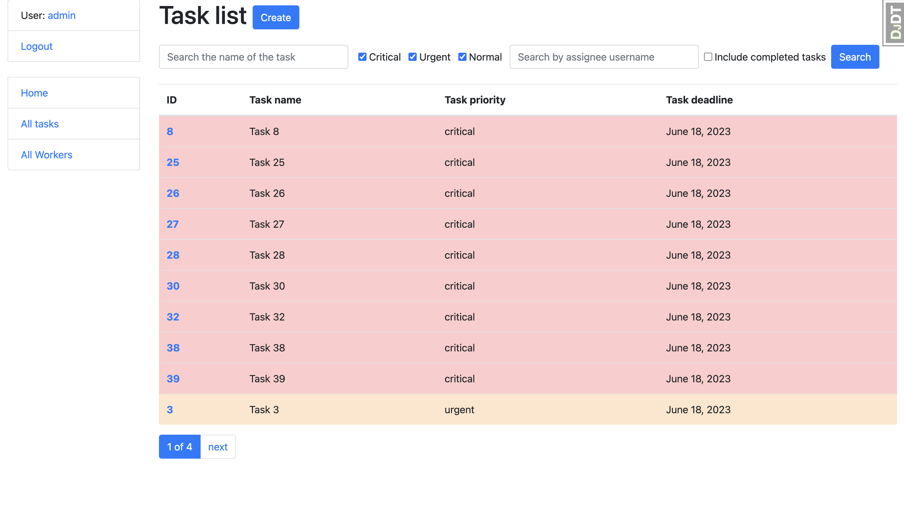

# Task Manager
[Check it out!](https://task-manager-y3r3.onrender.com/)

This is a Django project that implements a task management system. The project aims to provide a user-friendly interface for managing tasks and workers within an organization. It allows users to efficiently track and manage tasks, assign them to workers, and monitor their progress. By using this task management system, organizations can improve their productivity and ensure effective task allocation and completion.

## Installing / Getting started

A quick introduction of the minimal setup you need to get a task manager up &
running.

```shell
git clone https://github.com/IvanKorshunovE/task_manager
cd task_manager
python3 -m venv venv
source venv/bin/activate
pip install -r requirements.txt
python manage.py runserver # starts Django Server
```

After executing these commands, the Django server should be up and running, allowing you to access and interact with the task manager application.

## Features

What's all the bells and whistles this project can perform?
* Task Management: Users can create, view, update, and delete tasks. Each task has a name, description, deadline, priority level, task type, and assignees. Tasks can be marked as completed or not completed.
* Worker Management: Users can create, view, update, and delete workers. Each worker has a username, first name, last name, and position. Workers can be associated with tasks as assignees.
* User Authentication: The project includes authentication functionality using Django's built-in authentication system. Users need to log in to access certain views and perform actions like creating or updating tasks/workers.
* Dashboard: The index view provides a dashboard displaying various statistics related to tasks and workers. It shows the total number of tasks, workers, critical tasks, and incomplete tasks. It also tracks the number of visits to the index page.
* Search and Filtering: The project includes search and filtering functionality for both tasks and workers. Users can search for tasks by name and filter them based on priority, assignee, and completion status. Similarly, workers can be searched based on username, first name, and last name.
* Assignment and Completion: Workers can be assigned or unassigned to tasks using the ToggleAssignToTaskView. Tasks can be marked as completed or not completed using the ToggleCompleteTaskView. These views handle the logic for assigning/unassigning workers and toggling the completion status of tasks.

## Demo 



[//]: # (## Configuration)

[//]: # ()
[//]: # ([//]: # &#40;Here you should write what are all of the configurations a user can enter when&#41;)

[//]: # (using the project.)

[//]: # ()
[//]: # (#### Argument 1)

[//]: # (Type: `String`  )

[//]: # (Default: `'default value'`)

[//]: # ()
[//]: # (State what an argument does and how you can use it. If needed, you can provide)

[//]: # (an example below.)

[//]: # ()
[//]: # (Example:)

[//]: # (```bash)

[//]: # (awesome-project "Some other value"  # Prints "You're nailing this readme!")

[//]: # (```)

[//]: # ()
[//]: # (#### Argument 2)

[//]: # (Type: `Number|Boolean`  )

[//]: # (Default: 100)

[//]: # ()
[//]: # (Copy-paste as many of these as you need.)

[//]: # ()
[//]: # (## Contributing)

[//]: # ()
[//]: # (When you publish something open source, one of the greatest motivations is that)

[//]: # (anyone can just jump in and start contributing to your project.)

[//]: # ()
[//]: # (These paragraphs are meant to welcome those kind souls to feel that they are)

[//]: # (needed. You should state something like:)

[//]: # ()
[//]: # ("If you'd like to contribute, please fork the repository and use a feature)

[//]: # (branch. Pull requests are warmly welcome.")

[//]: # ()
[//]: # (If there's anything else the developer needs to know &#40;e.g. the code style)

[//]: # (guide&#41;, you should link it here. If there's a lot of things to take into)

[//]: # (consideration, it is common to separate this section to its own file called)

[//]: # (`CONTRIBUTING.md` &#40;or similar&#41;. If so, you should say that it exists here.)

[//]: # ()
[//]: # (## Links)

[//]: # ()
[//]: # (Even though this information can be found inside the project on machine-readable)

[//]: # (format like in a .json file, it's good to include a summary of most useful)

[//]: # (links to humans using your project. You can include links like:)

[//]: # ()
[//]: # (- Project homepage: https://your.github.com/awesome-project/)

[//]: # (- Repository: https://github.com/your/awesome-project/)

[//]: # (- Issue tracker: https://github.com/your/awesome-project/issues)

[//]: # (  - In case of sensitive bugs like security vulnerabilities, please contact)

[//]: # (    my@email.com directly instead of using issue tracker. We value your effort)

[//]: # (    to improve the security and privacy of this project!)

[//]: # (- Related projects:)

[//]: # (  - Your other project: https://github.com/your/other-project/)

[//]: # (  - Someone else's project: https://github.com/someones/awesome-project/)

[//]: # ()
[//]: # ()
[//]: # (## Licensing)

[//]: # ()
[//]: # (One really important part: Give your project a proper license. Here you should)

[//]: # (state what the license is and how to find the text version of the license.)

[//]: # (Something like:)

[//]: # ()
[//]: # ("The code in this project is licensed under MIT license.")